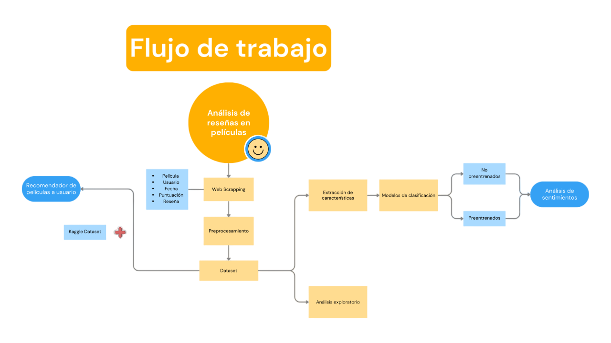

## Descripción de los archivos

### fine_tunning_collab.ipynb
Este notebook contiene el código para realizar el **fine-tuning** de un modelo BERT preentrenado (`google-bert/bert-base-cased`).  
Está diseñado para ejecutarse en **Google Colab**, facilitando el entrenamiento y ajuste fino del modelo sobre nuestro conjunto de datos específico, con el objetivo de mejorar su rendimiento en tareas de Procesamiento de Lenguaje Natural (NLP).

---

### proyecto_NLP.ipynb
Este notebook es el archivo principal del proyecto, donde se desarrolla el pipeline completo y el análisis relacionado con el proyecto de NLP.  
Incluye la preparación de datos, extracción de características, entrenamiento y evaluación de modelos, entre otros procesos fundamentales para el desarrollo integral del proyecto.



## Instalación de dependencias

Para instalar las dependencias necesarias para ejecutar el proyecto, puedes ejecutar el siguiente comando en la terminal (ya sea en Anaconda Prompt, VS Code o cualquier otra terminal):

```bash
pip install -r requirements.txt

