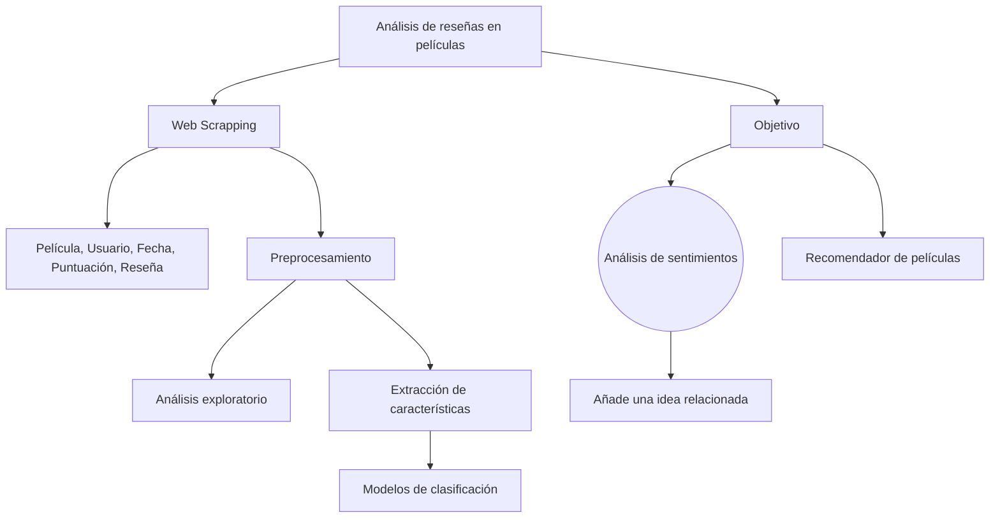

Para instalar las dependencias ejecutar "pip install -r requirements.txt" en la terminal (anaconda o VS) o en una celda del código de "proyecto_NLP.ipynb"



```mermaid
mindmap
  root((Análisis de reseñas en películas))
    Objetivo
      Sentimientos(Análisis de sentimientos)
      Recomendador(Recomendador de películas)
    WebScrapping(Web Scrapping)
      Datos[Película, Usuario, Fecha, Puntuación, Reseña]
    Preprocesamiento
      Exploratorio(Análisis exploratorio)
      Características(Extracción de características)
        Modelos(Modelos de clasificación)
          NoPreentrenados(No preentrenados)
          Preentrenados(Preentrenados)
